# PocketCare S - Server


**Call for code submission for COVID-19 track.**

PocketCare S is a comprehensive smartphone-based solution for monitoring close encounters. It is a bluetooth low energy (BLE) based solution which enables smartphones to send and receive anonymous beacon signals. It checks the distance between a smartphone and another beacon (or smartphone running PocketCare S) to see if they are close to each other (less than 2m). If so, the smartphone records the duration of such a close encounter with another beacon. 

PocketCare S is designed to report social distance information without collecting or revealing any personally identifiable information about any specific individual.


## Contents 
1. [Demo Video](#demo-video) 
2. [The Architecture](#the-architecture)
3. [Getting Started](#getting-started)
4. [How does PocketCare S Work?](#how-does-pocketcare-s-work)
5. [Built With](#built-with)
6. [Project RoadMap](#project-roadmap)
7. [Further Readings](#further-readings)
8. [License](#license)
9. [Acknowledgments](#acknowledgements)

## Demo Video 

[](http://www.youtube.com/watch?v=JnOWwagUgxQ "PocketCare S Demo")

## The Architecture


## Getting Started 

### High Level Architecture
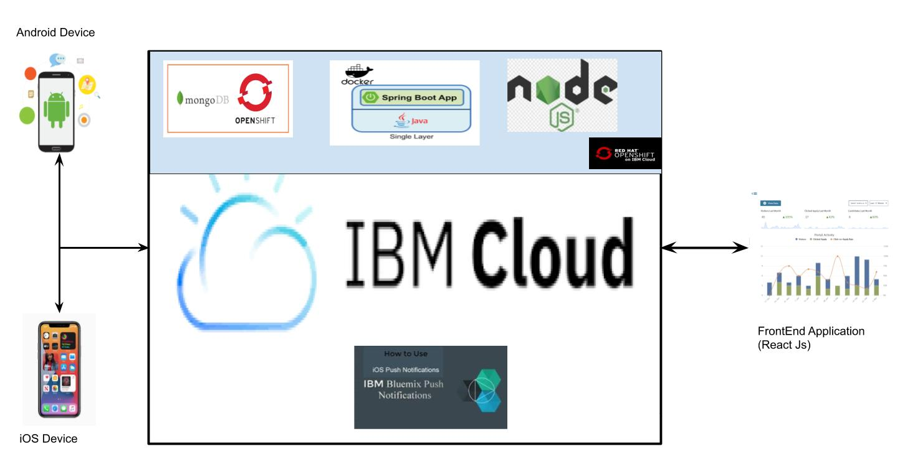

### API Documentation
[Postman Documentation Link](https://documenter.getpostman.com/view/3639058/T1DtdFNp?version=latest)

### Prerequisites for installation on local machine

Before you begin, make sure you satisfy the following requirements in order to run the server on your local system:

1. Spring Tool Suite latest version.
2. MongoDB Server setup on your local system. [Link](https://www.mongodb.com/try/download/community)
3. JAVA 8 or above installed on the system.
4. NPM (node package manager) which can be installed from [here](https://nodejs.org/en/download/)

### Steps to install server on local system

1. Clone the repository
2. Make sure the MongoDB server is up and running.
3. Open the project in the spring tool suite IDE
4. Configure the MongoDB server Credentials (if provided)
5. Configure the IBM push Notification credentials [reference](https://github.com/PocketCareS/server/blob/master/README.md#ibm-push-notification-java-sdk-setup)
6. Right-click on the project and run as spring boot app
7. Now you must see the project running on the server.
8. Get the IP address of your system.
9. Access the URL ```<ip>:8080/user/sample. If it prints "Hello World" ```Then the server is up and running.
10. Update the file ```src\main\resources\application.properties``` file
11. Configure the IP address in the Android [reference](https://github.com/PocketCareS/PocketCareS-Android/tree/development#running-pocketcare-s-using-android-studio), iOS [reference](https://github.com/PocketCareS/PocketCareS-iOS#installing-pocketcare-s-using-xcode) and web portal[reference](https://github.com/PocketCareS/webportal/blob/master/README.md#steps-for-running-on-local-system).

#### Steps to configure MongoDB database on IBM Openshift

1. Open the redshift console
2. After clicking on the project, a screen similar to the image below should appear. Just click on the Administrator in the top left corner and select Developer from the drop-down menu.

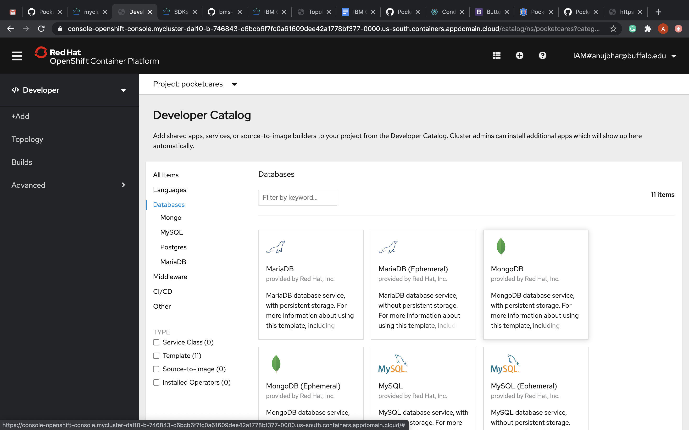

3. On screen select Database.
4. From the options displayed on the screen. Select the database as MongoDB service with persistent storage.

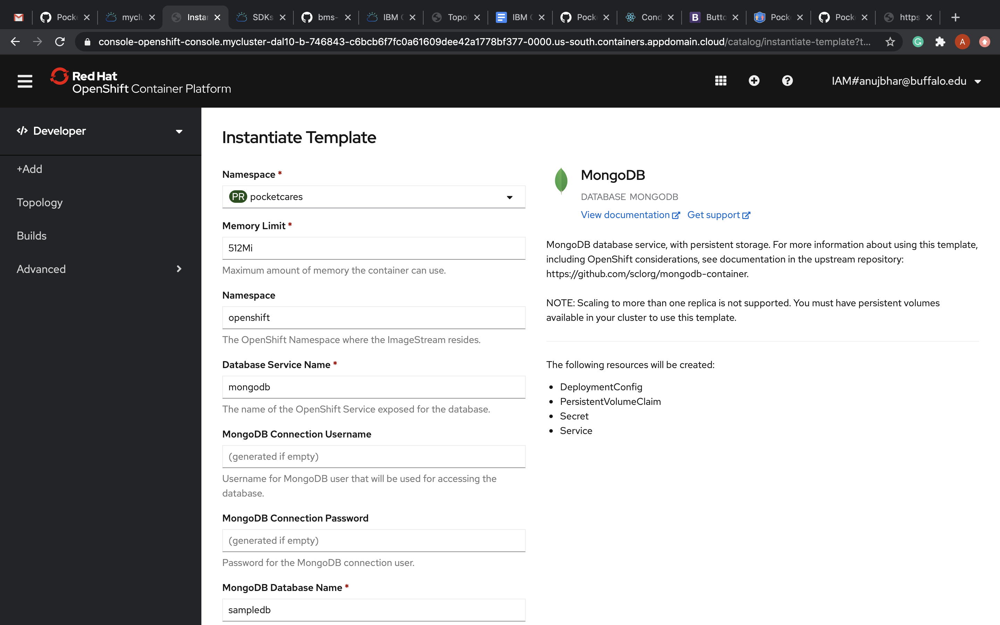

5. Select the DB name as &quot;pocketCare&quot;
6. provide the credentials as required. Remember the credentials as these will be required in configuring the server.
7. Let all other options be as is.
8. Drag to the bottom and select create.

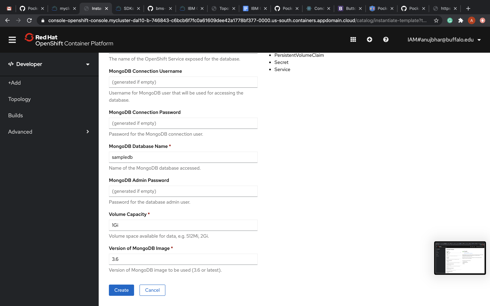

1. Navigate to the Developer > Topology on the left pane.
2.  Select the mongodb icon on the screen.
3.  On the window pop on right select services.
4.  From the service menu, select the Cluster IP that appears at the position marked in the image below.

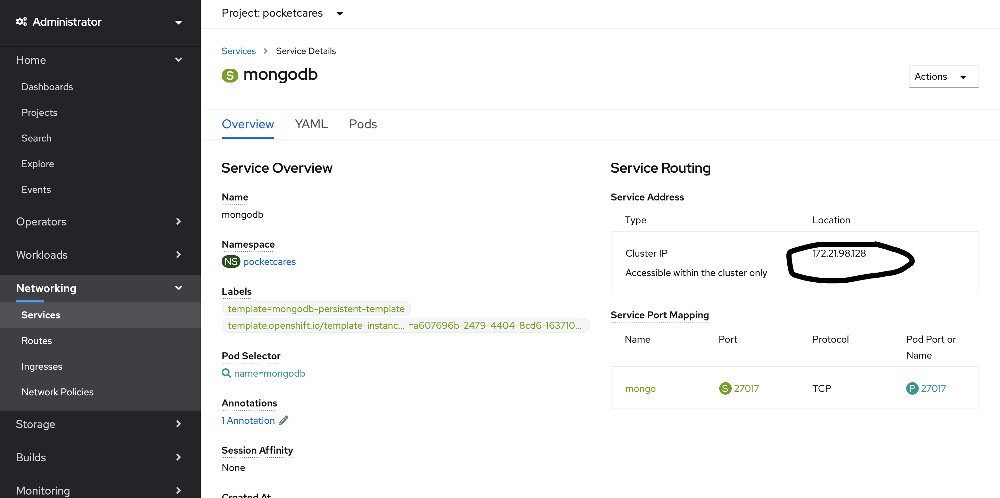

13. Open the server application on your system.
14. Open the src\main\resources\application.properties file
15. ```#mongodb://<db-username>:<db-password>@<db-ip>:<db-port>/${spring.data.mongodb.name}```
16. Mention the username, password.
17. Mention the cluster IP in place of ```<db-ip>```
18. By default dbport is 27017. If not, mention the customised port in place of db-port


### Steps to install server on IBM's cloud openshift 


1. Get a RedHat openshift device on IBM cloud with the configuration of your choice.

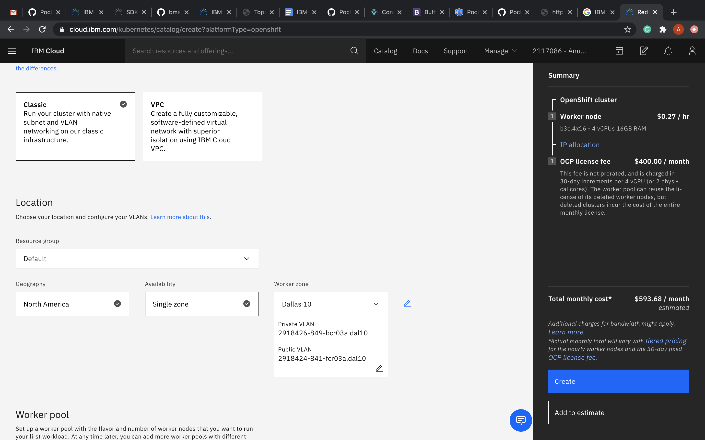

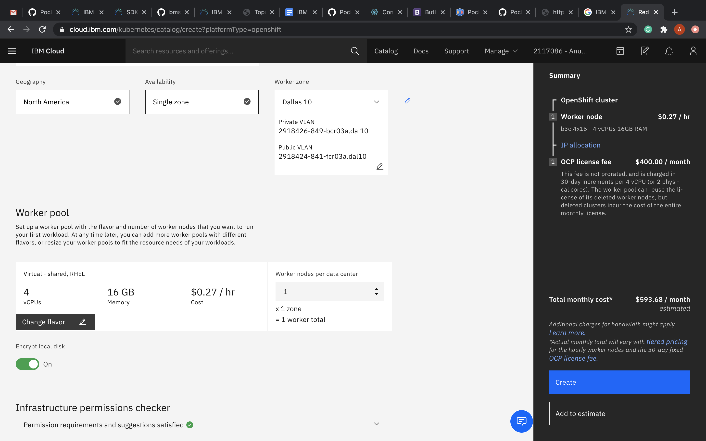

1. Open the redshift cloud console: Dashboard >Clusters >open cluster > openshift web console

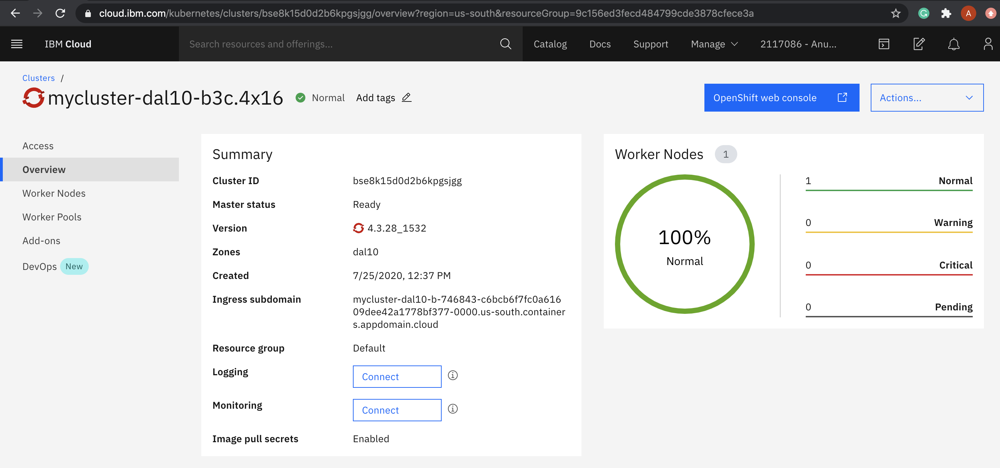

3. After clicking on the project, a screen similar to the image below should appear. Just click on the Administrator in the top left corner and select Developer from the drop-down menu. 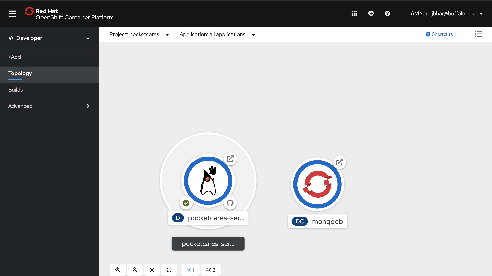
4. On the screen that loads, click on From Git.

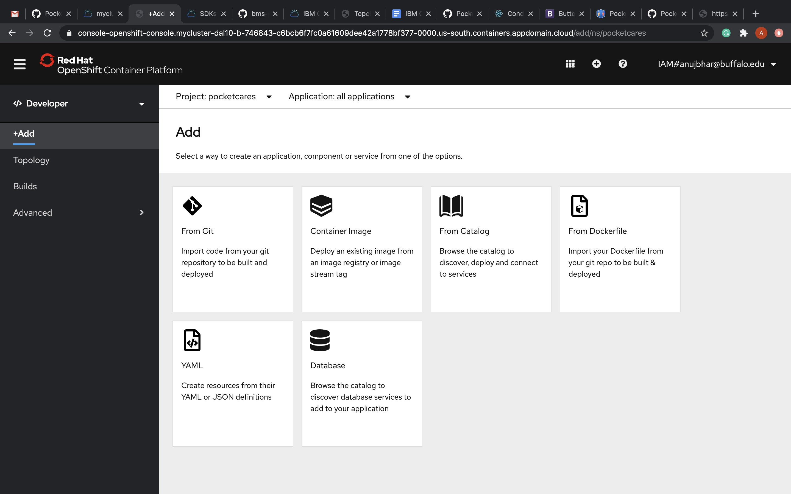
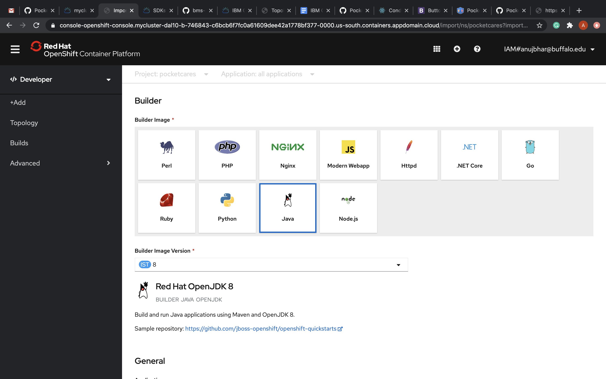

5. In the Git Repo URL section, paste the link &quot; **https://github.com/PocketCareS/server**&quot; from the Github repository.

Note: Click on More Advanced Options to specify the branch name(if-any). By default, the branch is master and we do not need to specify it.

6. Scroll down to select Builder Image. It is supposed to be Java in our case. After clicking on Java, make sure to change the Java version to 8 from the drop-down that appears. 
7. Let other options be as they are, no fiddling with them. Just make sure that the checkbox in the Advanced Options section is checked as shown in the image below and then click on Create.
8. Click on the penguin logo on the screen. We can see that a build is already in progress. Keep a little patience and wait for the build to finish.
9. As soon as the build is finished, a pod will automatically be deployed. Congratulations, you have successfully deployed your spring-boot application on Redhat Openshift nonchalantly.


10. To get the URL go under the Routes section.

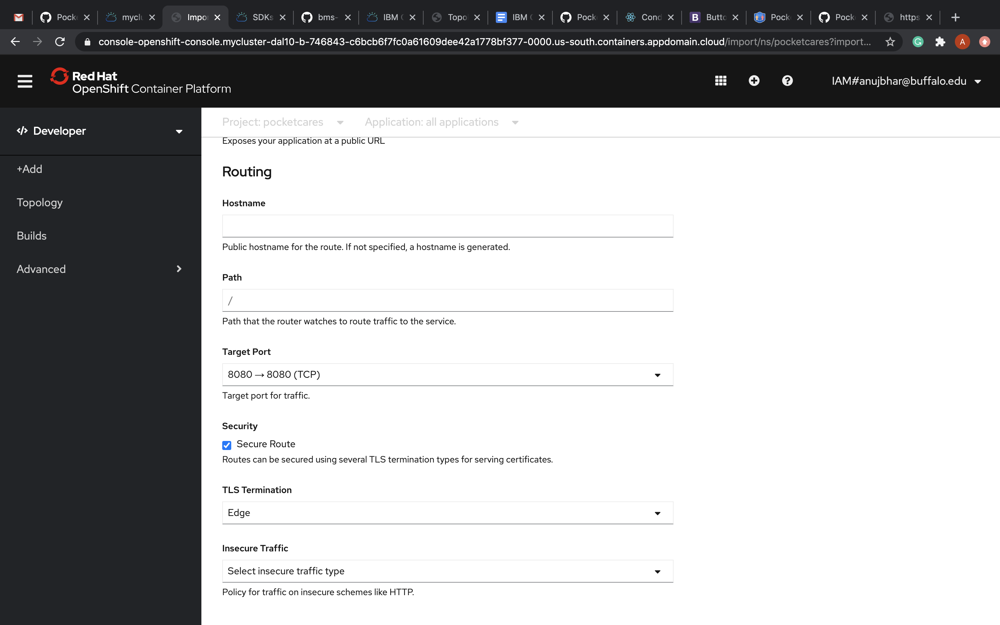

The link in this section is your newly deployed spring-boot application.


11. Get the IP address of your system.
12. Access the URL ```<ip\>/user/sample. If it prints "Hello World"``` Then the server is up and running.
13. Configure the IP address in the Android [reference], iOS [reference] and web portal[reference].
14. If on the deployment logs the SERVER_PORT issue appears. Navigate to the

Environment variables of the POD and enter the variable name as SERVER_PORT and value as 8080

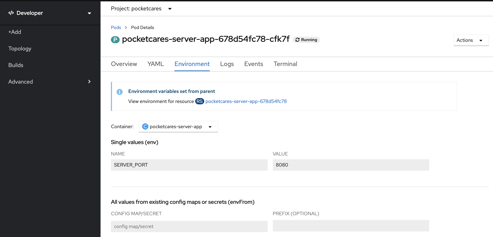


#### Deploy the server changes on the server.

1. For the IBM openshift.
2. Open the openshift web console.
3. Navigate to Developer>Topology
4. Click on Server.
5. On the right window, select start build.

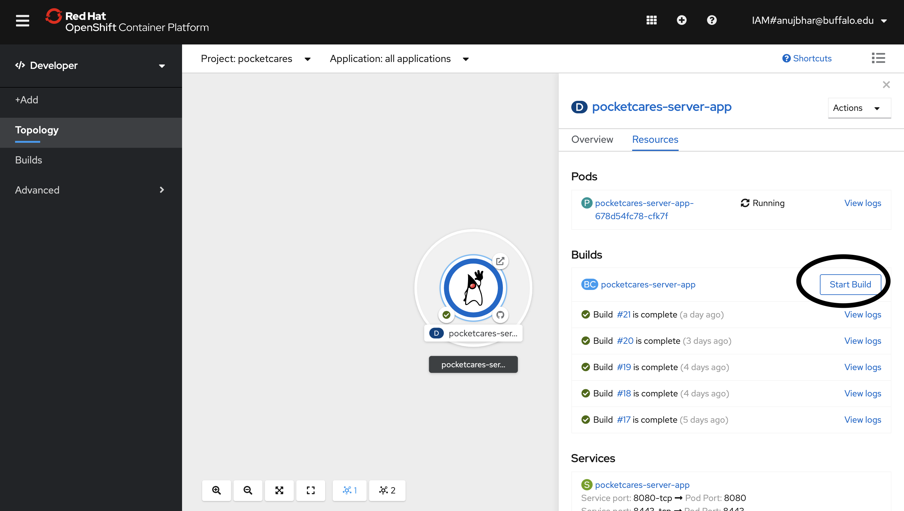

#### IBM Push Notification

1. Service instance for push notification: [https://cloud.ibm.com/docs/mobilepush?topic=mobilepush-push\_step\_1a](https://cloud.ibm.com/docs/mobilepush?topic=mobilepush-push_step_1a)

2. Obtain notification service provider credentials for Android based on the steps mentioned in the link [https://cloud.ibm.com/docs/mobilepush?topic=mobilepush-push\_step\_1](https://cloud.ibm.com/docs/mobilepush?topic=mobilepush-push_step_1)

3. Configure the service instance following the link as : [https://cloud.ibm.com/docs/mobilepush?topic=mobilepush-push\_step\_2](https://cloud.ibm.com/docs/mobilepush?topic=mobilepush-push_step_2)

4. Setup the client SDK : [https://cloud.ibm.com/docs/mobilepush?topic=mobilepush-push\_step\_3](https://cloud.ibm.com/docs/mobilepush?topic=mobilepush-push_step_3)

5. Android setup [reference](https://github.com/PocketCareS/PocketCareS-Android/tree/development#getting-app-client-id-for-exposure-notification)

##### IBM Push Notification JAVA SDK setup

1. Setup the JAVA SDK service.
2. Got to your IBM push notification service. [link](https://cloud.ibm.com/services/imfpush/crn%3Av1%3Abluemix%3Apublic%3Aimfpush%3Aus-south%3Aa%2F446673b322a041c3852f5abaf675bae9%3A2abe5c40-d5aa-4ff0-9b2e-d76327e76ee6%3A%3A?paneId=credentials)
 3. On the image given below. **Select Service Credentials** from left pane.
 4. Create new credentials if not already.

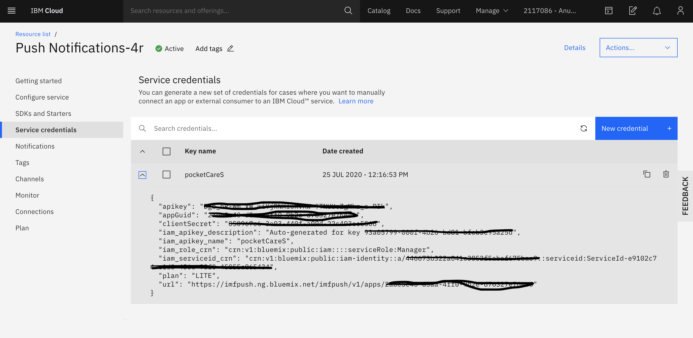

  1. Open the JAVA server application code on the IDE (sts)
  2. Navigate to the Class **src/main/java/com/PocketCare/pocketCare/Service/IBMNotificationService.java**
  3. Copy the appGuid from IBM console and paste at 
  ```Java private static final String **APIID= "YOUR IBM push notification APP ID";```
  4. Copy the apikey from IBM console and paste at 
  ```Java private static final String **APIKEY = "Your IBM push notifcation API KEY";```
  5. Build the server application on local or cloud console.

Once the application starts, follow the on-boarding process and read how P works below. 

## How does PocketCare S Work?

### Key Highlights (Mobile Application)

1. Close encounter data will be displayed in the mobile application after a close encounter session starts. A close encounter session starts when two people are within **2 meters** for at least **5 minutes**. 
2. The **virtual bluetooth name** changes every hour to ensure **user privacy**. 
3. Data upload to the server takes place every hour.
4. Data is stored in user's phone for a maximum of 14 days. 

### Detailed Architecture 


### Technological Advances


### Security and Privacy 


For a more detailed description, refer to [further reading](#further-readings) section. 


## Built With 

In this submission, we have used IBM’s Cloud **Red Hat OpenShift** to deploy our server (using **OpenJDK 8**), database (using **MongoDB**), the web portal (using **Node Js server**) and **IBM Push notification service** from **IBM Bluemix** in the android application of PocketCare S as a proof of concept. In the future, we will consider integrating other IBM services into the PocketCare S solution.

## Project RoadMap 

## Further Readings

You can find more information about PocketCare S here:

1. [Website](https://engineering.buffalo.edu/computer-science-engineering/pocketcares.html) 
2. [White Paper](https://docs.google.com/document/d/e/2PACX-1vT6UqA3HByzG5Di576gmz-JWzgKOFx5KLYGgJMpxcmWkOXYJ_vUFz2h1w2LnDNWI4y-xnyKhPi_s70p/pub)

## License 

This project is licensed under the Apache 2 License - see the LICENSE file for details

## Acknowledgements
